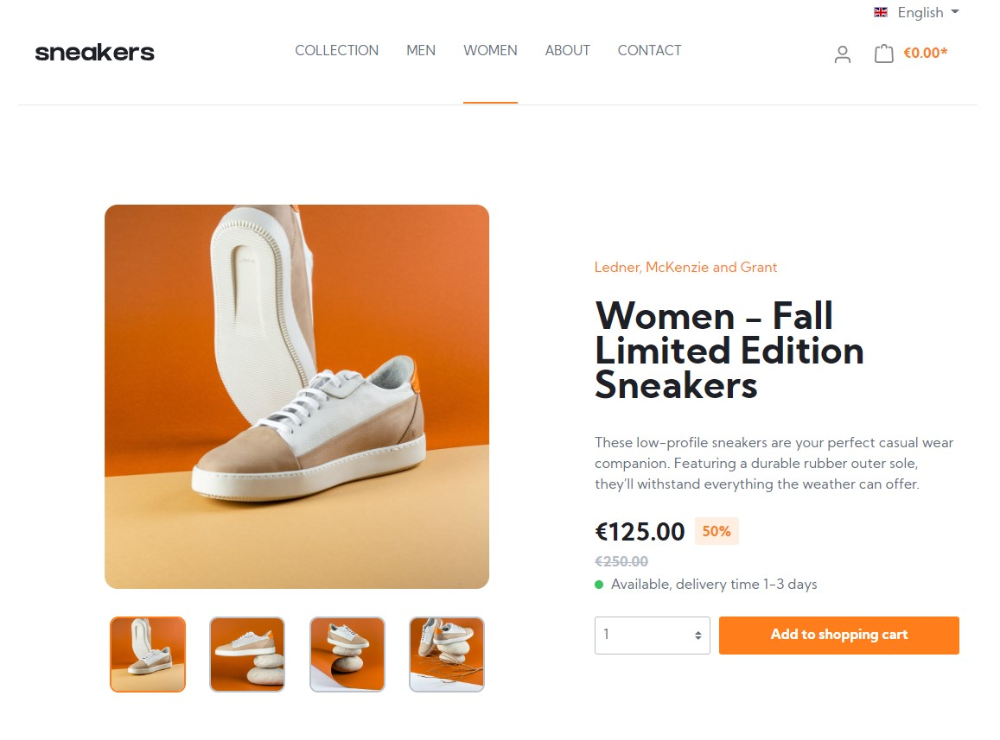

# Frontend Mentor - E-commerce product page solution

This is a solution to the [E-commerce product page challenge on Frontend Mentor](https://www.frontendmentor.io/challenges/ecommerce-product-page-UPsZ9MJp6). Frontend Mentor challenges help you improve your coding skills by building realistic projects.

## Table of contents

- [Overview](#overview)
     - [The challenge](#the-challenge)
     - [Screenshot](#screenshot)
     - [Links](#links)
- [My process](#my-process)
     - [Built with](#built-with)
     - [What I learned](#what-i-learned)
     - [Continued development](#continued-development)
     - [Useful resources](#useful-resources)
- [Author](#author)
- [Acknowledgments](#acknowledgments)

## Overview

### The challenge

- Implement design as shopware.com theme.
- View the optimal layout for the site depending on their device's screen size
- See hover states for all interactive elements on the page
- Open a lightbox gallery by clicking on the large product image
- Switch the large product image by clicking on the small thumbnail images
- Add items to the cart
- View the cart and remove items from it

### Screenshot

### Links

- Solution URL: [Add solution URL here](https://your-solution-url.com)
- Live Site URL: [https://sneakers.edmadd.eu/en/](https://sneakers.edmadd.eu/en/)

## My process

### Built with

- [Shopware/Symfony project](https://developers.shopware.com/) - For shopware development
- [Symfony/Twig templating](https://twig.symfony.com/) - For custom shopware design
- SCSS custom properties
- Flexbox
- Mobile-first workflow

### What I learned

- How to setup the development environment for shopware / symfony development.
- Implement a provided design as custom template in shopware.
- Setup and pubish an shopware store with custom template.

### Continued development

Implement further stores with shopware.

### Useful resources

- [Shopware developers](https://developers.shopware.com/) - This helped me with the setup and implementation of the complete development work with shopware.
- [Twig template engine](https://twig.symfony.com/) - This helped me with all specific questions regarding the templating.

## Author

- Website - [EdMadd Profile Page](https://profilepage.edmadd.eu/)
- Frontend Mentor - [@MartinEichinger](https://www.frontendmentor.io/profile/MartinEichinger)
- LinkedIn - [@MartinEichinger](https://www.linkedin.com/in/martin-eichinger-31a53a201/)
